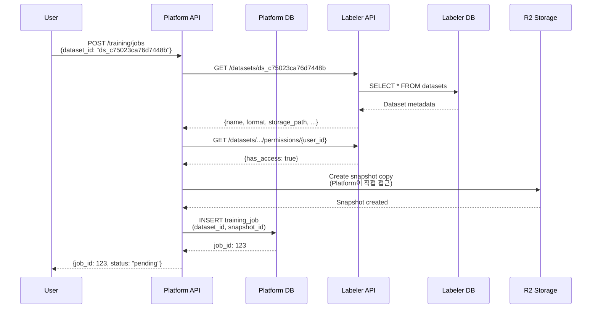

# Labeler Dataset API Requirements

**작성일**: 2025-11-27
**대상**: Labeler 팀
**목적**: Platform ↔ Labeler 데이터셋 관리 통합

---

## 1. 배경 (Background)

### 1.1 문제 인식

**현재 상황**:
- 데이터셋 관리가 **Platform → Labeler**로 이전됨
- Platform DB에 Dataset 테이블이 남아있음 (레거시)
- **Data Duplication 문제**: Platform DB와 Labeler DB 간 데이터 정합성 이슈

**아키텍처 원칙**:
```
┌─────────────────┐
│ Labeler Backend │ ← Dataset의 Single Source of Truth
│  (Labeler DB)   │ ← CRUD 관리 (Create, Read, Update, Delete)
└────────┬────────┘
         │ REST API
         ▼
┌─────────────────┐
│Platform Backend │ ← Dataset 조회만 (Read-only)
│  (Platform DB)  │ ← FK 참조 목적으로 dataset_id 저장
└─────────────────┘
```

### 1.2 Platform DB의 Dataset 의존성

Platform Backend에서 Dataset 테이블을 참조하는 곳:

| 테이블/모델 | FK 필드 | 용도 |
|------------|---------|------|
| **TrainingJob** | `dataset_id` | 학습에 사용할 데이터셋 참조 |
| **Invitation** | `dataset_id` | 데이터셋 협업 초대 |
| **DatasetPermission** | `dataset_id` | 데이터셋 접근 권한 관리 |
| **User** | `owned_datasets` | 사용자 소유 데이터셋 관계 |

**핵심 요구사항**:
- Platform은 `dataset_id` (UUID)만 저장
- 실제 데이터셋 메타데이터는 Labeler API로 조회
- 권한 확인도 Labeler API 사용
- **Snapshot 관리는 Platform의 책임** (Labeler API 범위 밖)

---

## 2. 필수 API 엔드포인트

### 2.1 Dataset 조회 (Read Operations)

#### 2.1.1 단일 데이터셋 조회

**Endpoint**: `GET /api/v1/datasets/{dataset_id}`

**목적**: Platform에서 Training Job 생성 시 데이터셋 정보 확인

**Request**:
```http
GET /api/v1/datasets/ds_c75023ca76d7448b HTTP/1.1
Host: labeler-api.example.com
Authorization: Bearer {platform_service_token}
```

**Response** (200 OK):
```json
{
  "id": "ds_c75023ca76d7448b",
  "name": "mvtec-bottle-detection",
  "description": "MVTec Bottle Detection Dataset",
  "format": "coco",
  "labeled": true,
  "storage_type": "r2",
  "storage_path": "datasets/ds_c75023ca76d7448b/",
  "annotation_path": "datasets/ds_c75023ca76d7448b/annotations_detection.json",
  "num_classes": 2,
  "num_images": 1000,
  "class_names": ["broken", "normal"],
  "tags": ["mvtec", "bottle", "detection"],
  "visibility": "public",
  "owner_id": 1,
  "created_at": "2025-11-20T10:00:00Z",
  "updated_at": "2025-11-27T09:30:00Z",
  "version": 1,
  "content_hash": "sha256:abc123..."
}
```

**Error Cases**:
- `404 Not Found`: Dataset not found
- `403 Forbidden`: No access permission

---

#### 2.1.2 데이터셋 목록 조회 (사용자별)

**Endpoint**: `GET /api/v1/datasets`

**목적**: Platform에서 Training Job 생성 시 사용 가능한 데이터셋 목록 제공

**Query Parameters**:
- `user_id` (optional): 특정 사용자 소유 데이터셋 필터
- `visibility` (optional): `public`, `private`, `organization`
- `labeled` (optional): `true`, `false`
- `tags` (optional): Comma-separated tags (e.g., `"detection,mvtec"`)
- `format` (optional): `coco`, `yolo`, `dice`, `imagefolder`
- `page` (optional): Pagination page number (default: 1)
- `limit` (optional): Items per page (default: 50, max: 200)

**Request**:
```http
GET /api/v1/datasets?visibility=public&labeled=true&format=coco&limit=10 HTTP/1.1
Host: labeler-api.example.com
Authorization: Bearer {platform_service_token}
```

**Response** (200 OK):
```json
{
  "total": 150,
  "page": 1,
  "limit": 10,
  "datasets": [
    {
      "id": "ds_c75023ca76d7448b",
      "name": "mvtec-bottle-detection",
      "description": "MVTec Bottle Detection Dataset",
      "format": "coco",
      "labeled": true,
      "num_images": 1000,
      "num_classes": 2,
      "visibility": "public",
      "owner_id": 1,
      "storage_type": "r2",
      "created_at": "2025-11-20T10:00:00Z"
    },
    ...
  ]
}
```

---

#### 2.1.3 데이터셋 접근 권한 확인

**Endpoint**: `GET /api/v1/datasets/{dataset_id}/permissions/{user_id}`

**목적**: Platform에서 특정 사용자가 데이터셋에 접근 가능한지 확인

**Request**:
```http
GET /api/v1/datasets/ds_c75023ca76d7448b/permissions/42 HTTP/1.1
Host: labeler-api.example.com
Authorization: Bearer {platform_service_token}
```

**Response** (200 OK):
```json
{
  "dataset_id": "ds_c75023ca76d7448b",
  "user_id": 42,
  "has_access": true,
  "role": "viewer",
  "reason": "public_dataset"
}
```

**Possible Reasons**:
- `"owner"`: User owns the dataset
- `"public_dataset"`: Dataset is public
- `"organization_member"`: User is in the same organization
- `"explicit_permission"`: User has been granted permission
- `"no_access"`: User cannot access

---

### 2.2 Dataset 다운로드 URL 생성

#### 2.2.1 Presigned URL 생성 (R2 다운로드)

**Endpoint**: `POST /api/v1/datasets/{dataset_id}/download-url`

**목적**: Platform Training Service가 데이터셋을 다운로드할 수 있는 임시 URL 생성

**Request**:
```http
POST /api/v1/datasets/ds_c75023ca76d7448b/download-url HTTP/1.1
Host: labeler-api.example.com
Authorization: Bearer {platform_service_token}
Content-Type: application/json

{
  "user_id": 42,
  "expiration_seconds": 3600,
  "purpose": "training_job_123"
}
```

**Response** (200 OK):
```json
{
  "dataset_id": "ds_c75023ca76d7448b",
  "download_url": "https://r2.example.com/datasets/ds_c75023ca76d7448b/archive.zip?signature=...",
  "expires_at": "2025-11-27T11:15:00Z",
  "format": "zip",
  "size_bytes": 524288000,
  "manifest": {
    "images": "images/",
    "annotations": "annotations_detection.json",
    "readme": "README.md"
  }
}
```

**Notes**:
- Presigned URL은 expiration 이후 자동 만료
- R2 S3-compatible API 사용
- Training Service에서 직접 다운로드

---

### 2.3 Dataset 메타데이터 조회 (Bulk)

#### 2.3.1 여러 데이터셋 조회 (Batch)

**Endpoint**: `POST /api/v1/datasets/batch`

**목적**: Platform에서 여러 Training Job의 데이터셋 정보를 한 번에 조회

**Request**:
```http
POST /api/v1/datasets/batch HTTP/1.1
Host: labeler-api.example.com
Authorization: Bearer {platform_service_token}
Content-Type: application/json

{
  "dataset_ids": [
    "ds_c75023ca76d7448b",
    "ds_abc123",
    "ds_xyz789"
  ],
  "fields": ["id", "name", "num_images", "format", "storage_path"]
}
```

**Response** (200 OK):
```json
{
  "datasets": {
    "ds_c75023ca76d7448b": {
      "id": "ds_c75023ca76d7448b",
      "name": "mvtec-bottle-detection",
      "num_images": 1000,
      "format": "coco",
      "storage_path": "datasets/ds_c75023ca76d7448b/"
    },
    "ds_abc123": {
      "id": "ds_abc123",
      "name": "coco128",
      "num_images": 128,
      "format": "coco",
      "storage_path": "datasets/ds_abc123/"
    },
    "ds_xyz789": null
  },
  "errors": {
    "ds_xyz789": "Dataset not found"
  }
}
```

---

## 3. 인증 및 보안 (Authentication & Security)

### 3.1 Service-to-Service 인증

**방법**: JWT Bearer Token (Service Account)

**Platform Service Account 발급**:
```http
POST /api/v1/auth/service-accounts HTTP/1.1
Host: labeler-api.example.com
Authorization: Bearer {admin_token}
Content-Type: application/json

{
  "service_name": "vision-platform",
  "scopes": ["datasets:read", "datasets:download", "datasets:permissions"]
}
```

**Response**:
```json
{
  "service_account_id": "sa_platform_12345",
  "api_key": "labeler_service_key_abc123def456",
  "scopes": ["datasets:read", "datasets:download", "datasets:permissions"],
  "expires_at": null
}
```

**Usage in Platform**:
```python
# platform/backend/.env
LABELER_API_URL=https://labeler-api.example.com
LABELER_SERVICE_KEY=labeler_service_key_abc123def456

# platform/backend/app/services/labeler_client.py
import httpx

class LabelerClient:
    def __init__(self):
        self.base_url = settings.LABELER_API_URL
        self.headers = {
            "Authorization": f"Bearer {settings.LABELER_SERVICE_KEY}"
        }

    async def get_dataset(self, dataset_id: str):
        async with httpx.AsyncClient() as client:
            response = await client.get(
                f"{self.base_url}/api/v1/datasets/{dataset_id}",
                headers=self.headers
            )
            return response.json()
```

### 3.2 Rate Limiting

**권장 제한**:
- Service Account: 1000 requests/minute
- Per Dataset ID: 100 requests/minute

**Response Headers**:
```http
X-RateLimit-Limit: 1000
X-RateLimit-Remaining: 950
X-RateLimit-Reset: 1701090000
```

---

## 4. 데이터 마이그레이션 계획

### 4.1 Platform DB Dataset 테이블 처리

**Phase 1**: Labeler API 구현 (Labeler 팀)
- 위 엔드포인트 구현
- Service Account 인증 추가
- R2 Presigned URL 생성

**Phase 2**: Platform 통합 (Platform 팀)
- `LabelerClient` 구현
- Dataset API 엔드포인트를 Labeler API 프록시로 변경
- Training Job 생성 시 Labeler API 호출

**Phase 3**: Dataset 테이블 마이그레이션
```sql
-- Platform DB에서 Dataset 테이블 제거 (FK 관계 유지)
-- dataset_id는 VARCHAR로 유지 (Labeler에서 발급한 ID)

-- TrainingJob, Invitation 등은 dataset_id만 저장
-- 실제 메타데이터는 Labeler API로 조회
```

**Phase 4**: 기존 데이터 동기화
```python
# 스크립트: migrate_datasets_to_labeler.py
# Platform DB의 기존 Dataset 레코드를 Labeler DB로 이전
```

---

## 5. API 호출 흐름 예시

### 5.1 Training Job 생성 시나리오



---

## 6. 에러 핸들링

### 6.1 표준 에러 응답

```json
{
  "error": {
    "code": "DATASET_NOT_FOUND",
    "message": "Dataset ds_xyz789 not found",
    "details": {
      "dataset_id": "ds_xyz789"
    },
    "timestamp": "2025-11-27T10:30:00Z"
  }
}
```

### 6.2 에러 코드 목록

| HTTP Status | Error Code | Description |
|-------------|------------|-------------|
| 404 | `DATASET_NOT_FOUND` | Dataset ID not found |
| 403 | `ACCESS_DENIED` | User lacks permission |
| 400 | `INVALID_DATASET_ID` | Malformed dataset ID |
| 429 | `RATE_LIMIT_EXCEEDED` | Too many requests |
| 500 | `INTERNAL_ERROR` | Server error |
| 503 | `R2_UNAVAILABLE` | R2 storage temporarily unavailable |

---

## 7. 성능 요구사항

### 7.1 응답 시간

| Endpoint | Target Latency (P95) |
|----------|----------------------|
| GET /datasets/{id} | < 100ms |
| GET /datasets (list) | < 300ms |
| GET /permissions/{user_id} | < 150ms |
| POST /download-url | < 200ms |
| POST /batch | < 500ms (up to 50 IDs) |

### 7.2 Availability

- **SLA**: 99.9% uptime
- **Failover**: R2 unavailable 시 cached metadata 반환
- **Retry**: Exponential backoff (Platform → Labeler)

---

## 8. 테스트 계획

### 8.1 Labeler 팀 제공

- **Postman Collection**: 모든 엔드포인트 샘플 요청
- **Mock Data**: 테스트용 데이터셋 3개 (R2에 사전 업로드)
- **Service Account**: Platform 팀 전용 테스트 계정

### 8.2 통합 테스트

```bash
# Platform에서 실행
pytest tests/integration/test_labeler_client.py -v

# Tests:
# - test_get_dataset_success
# - test_get_dataset_not_found
# - test_generate_download_url
# - test_check_permissions
```

---

## 9. 타임라인

| Phase | Owner | Duration | Deliverable |
|-------|-------|----------|-------------|
| API 설계 리뷰 | Both | 1 day | 이 문서 승인 |
| Labeler API 구현 | Labeler | 3 days | 엔드포인트 + 인증 |
| Platform Client 구현 | Platform | 2 days | LabelerClient + 테스트 |
| 통합 테스트 | Both | 1 day | E2E 테스트 통과 |
| Production 배포 | Both | 1 day | Monitoring 설정 |

**Total**: ~1주일

---

## 10. 연락처

**Platform 팀**: platform@example.com
**Labeler 팀**: labeler@example.com
**Slack Channel**: #dataset-integration

---

## Appendix A: OpenAPI Specification

```yaml
openapi: 3.0.0
info:
  title: Labeler Dataset API
  version: 1.0.0
  description: Dataset management API for Platform integration

servers:
  - url: https://labeler-api.example.com/api/v1

paths:
  /datasets/{dataset_id}:
    get:
      summary: Get dataset by ID
      parameters:
        - name: dataset_id
          in: path
          required: true
          schema:
            type: string
      responses:
        '200':
          description: Dataset found
          content:
            application/json:
              schema:
                $ref: '#/components/schemas/Dataset'
        '404':
          description: Dataset not found

components:
  schemas:
    Dataset:
      type: object
      properties:
        id:
          type: string
        name:
          type: string
        format:
          type: string
          enum: [coco, yolo, dice, imagefolder]
        num_images:
          type: integer
        storage_path:
          type: string
      required:
        - id
        - name
        - format
```

---

**문서 버전**: 1.0
**마지막 업데이트**: 2025-11-27
**작성자**: Platform Architecture Team
